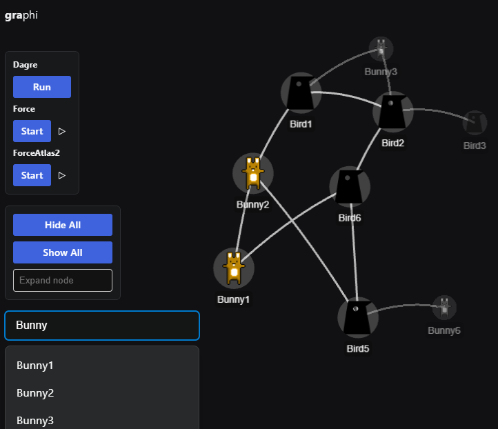

# graphi

A minimal project for building interactive graph visualizations in the browser.



## Frameworks & Libraries

### Graphology
[Graphology](https://github.com/graphology/graphology) is used as the data backend. It handles:
- Nodes and edges with customizable attributes  
- Subgraph operations and filtering  
- Various algorithms (e.g., centrality measures, shortest paths, etc.)

### PixiJS 8
[PixiJS](https://pixijs.com/) provides performant, WebGL-based rendering.

### React
React is used for the user interface, including menus, panels, and other controls.  
- **Radix**: [Radix](https://www.radix-ui.com/) is used as the UI component library.

### Additional Libraries
- **[dagre](https://github.com/dagrejs/dagre)** – Calculates hierarchical layouts for directed graphs.  
- **[pixi-viewport](https://github.com/pixijs-userland/pixi-viewport)** – Adds panning, zooming, and other viewport management features on top of PixiJS.  
- **[elkjs](https://github.com/kieler/elkjs)** – Layouts for complex graphs.

## Run
1. **Install dependencies**:
   ```bash
   npm install
   ```
2. **Start the development server**:
   ```bash
   npm run dev
   ```

## Develop
- If you want to debug with **PixiJS DevTools**, make sure `@pixi/devtools` is installed (already included in this project).  

## Similar Projects
- **[zakjan/pixi-graph](https://github.com/zakjan/pixi-graph)**
- **[Cytoscape.js](https://github.com/cytoscape/cytoscape.js)**
- **[Sigma.js](https://www.sigmajs.org/)**
- **[Reagraph](https://reagraph.dev/)**
